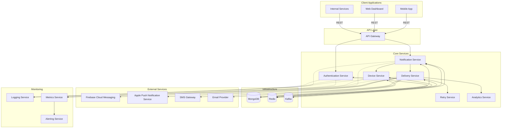

# Notification Service - High-Level Design

## 1. Overview

The Notification Service is a scalable, microservices-based platform designed to manage and deliver notifications across multiple channels. It provides a reliable, fault-tolerant system for sending push notifications to mobile devices with support for features like prioritization, scheduling, and delivery tracking.

## 2. Architecture Diagram

## 3. Component Descriptions

### 3.1 API Gateway
- Entry point for all client requests
- Handles routing, authentication, and request validation
- Implements rate limiting and API versioning
- Provides unified API for all notification operations

### 3.2 Authentication Service
- Manages JWT-based authentication
- Handles role-based access control
- Validates service-to-service authentication
- Provides security middleware for API routes

### 3.3 Notification Service
- Core component for notification creation and management
- Handles notification prioritization and scheduling
- Implements notification templating
- Manages notification queues using Redis and Kafka
- Ensures idempotent notification processing

### 3.4 Delivery Service
- Handles the actual delivery of notifications
- Manages platform-specific formatting (FCM, APNS)
- Records delivery attempts and status
- Implements channel-specific rate limiting
- Coordinates with the Retry Service for failed deliveries

### 3.5 Device Service
- Manages device registration and token storage
- Handles user-device associations
- Maintains device notification preferences
- Implements quiet hours and category filtering
- Tracks device activity and platform details

### 3.6 Retry Service
- Implements retry strategies for failed notifications
- Applies exponential backoff with jitter
- Manages maximum retry attempts by priority
- Handles dead-letter scenarios for permanently failed deliveries

### 3.7 Analytics Service
- Collects notification delivery and engagement metrics
- Generates performance reports and dashboards
- Provides insights on notification effectiveness
- Tracks conversion rates and user engagement

### 3.8 Infrastructure Components

#### MongoDB
- Primary data store for notification data, devices, and delivery tracking
- Provides flexible schema for different notification types
- Supports sharding for horizontal scaling
- Used for persistent storage of all service data

#### Redis
- In-memory data store for caching and message queuing
- Handles rate limiting and distributed locking
- Manages notification delivery queues
- Caches device state and user preferences

#### Kafka
- Distributed event streaming platform for high-throughput messaging
- Used for event sourcing and service communication
- Provides durable message storage for event replay
- Enables real-time analytics and monitoring

### 3.9 External Services

#### Firebase Cloud Messaging (FCM)
- Google's push notification service for Android and iOS devices
- Supports high-volume, multicast notifications
- Provides analytics and delivery reporting

#### Apple Push Notification Service (APNS)
- Apple's notification service for iOS devices
- Requires certificate-based authentication
- Implements device token-based delivery

## 4. Key Technical Decisions

### 4.1 Database Selection
MongoDB was chosen for its flexibility, scalability, and document-oriented structure that aligns well with the variable notification data model. The schemaless nature allows for easy extension to support new notification types.

### 4.2 Queuing System
A dual approach with Redis and Kafka is used:
- Redis for immediate, high-priority notifications requiring low latency
- Kafka for high-volume notifications, event sourcing, and analytics

### 4.3 Service Communication
- Synchronous: REST APIs for client-facing and critical internal operations
- Asynchronous: Kafka for event-driven communication between services

### 4.4 Scalability Approach
- Stateless services for horizontal scaling
- Sharded MongoDB for data distribution
- Redis clustering for queue distribution
- Kafka partitioning for parallel processing

### 4.5 Security Implementation
- JWT-based authentication for all API access
- HTTPS/TLS for all communications
- Role-based access control for administrative functions
- API keys for service-to-service communication
- Data encryption for sensitive fields

## 5. Data Flow Patterns

The system uses several key data flow patterns:

1. **Request-Response**: For API calls and immediate responses
2. **Publish-Subscribe**: For event distribution and notification
3. **Command**: For triggered actions like sending a notification
4. **Event Sourcing**: For tracking the complete notification lifecycle
5. **CQRS (Command Query Responsibility Segregation)**: Separating write and read operations for notifications

## 6. Cross-Cutting Concerns

### 6.1 Observability
- Structured logging with correlation IDs
- Metrics collection for performance monitoring
- Health checks for all services
- Distributed tracing for request flows

### 6.2 Resilience
- Circuit breakers for external service calls
- Rate limiting to prevent system overload
- Retry strategies with exponential backoff
- Graceful degradation when dependencies fail

### 6.3 Performance
- Caching for frequently accessed data
- Asynchronous processing for long-running operations
- Database indexing and query optimization
- Batch processing for high-volume notifications 