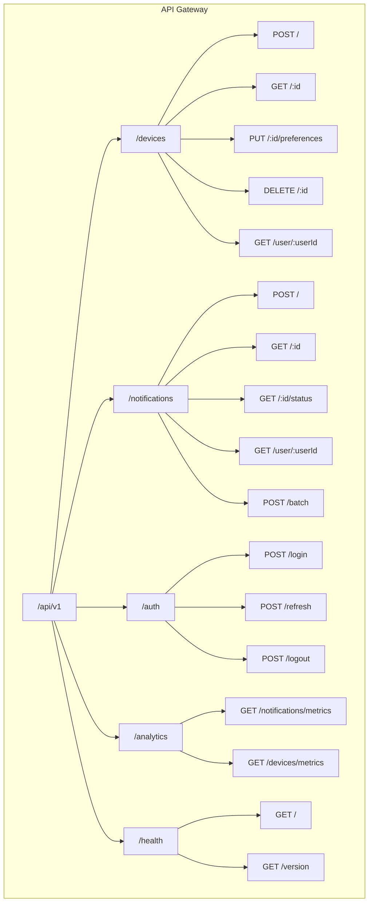
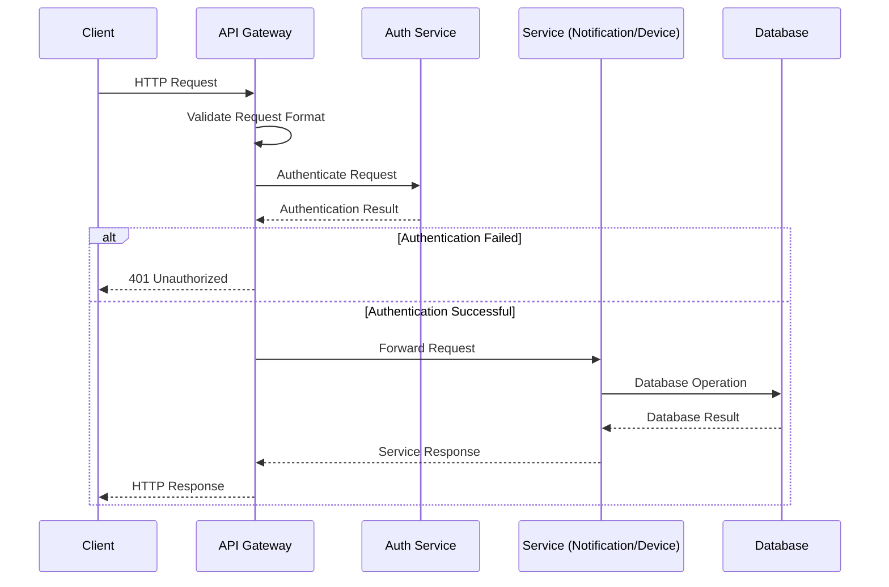

# API Contract

This document describes the API contract for the Notification Service.

## API Gateway Structure



## Request/Response Flow



## Device API

### Register Device

**Endpoint:** `POST /api/v1/devices`

**Request:**
```json
{
  "user_id": "user123",
  "device_token": "fcm-token-123",
  "platform": "android",
  "app_version": "1.0.0",
  "device_model": "Pixel 6",
  "os_version": "Android 13",
  "language": "en-US",
  "timezone": "America/New_York",
  "notification_preferences": {
    "enabled": true,
    "categories": {
      "marketing": true,
      "transactional": true
    },
    "quiet_hours": {
      "enabled": true,
      "start": "22:00",
      "end": "08:00",
      "timezone": "America/New_York"
    }
  }
}
```

**Response:**
```json
{
  "device_id": "device-456",
  "status": "registered"
}
```

**Status Codes:**
- `200 OK`: Device registered successfully
- `400 Bad Request`: Invalid request parameters
- `401 Unauthorized`: Authentication failed
- `409 Conflict`: Device token already registered to another user
- `500 Internal Server Error`: Server error

### Get Device by ID

**Endpoint:** `GET /api/v1/devices/:id`

**Response:**
```json
{
  "_id": "device-456",
  "user_id": "user123",
  "device_token": "fcm-token-123",
  "platform": "android",
  "app_version": "1.0.0",
  "device_model": "Pixel 6",
  "os_version": "Android 13",
  "language": "en-US",
  "timezone": "America/New_York",
  "notification_preferences": {
    "enabled": true,
    "categories": {
      "marketing": true,
      "transactional": true
    },
    "quiet_hours": {
      "enabled": true,
      "start": "22:00",
      "end": "08:00",
      "timezone": "America/New_York"
    }
  },
  "created_at": "2023-07-21T12:34:56Z",
  "updated_at": "2023-07-21T12:34:56Z",
  "last_seen": "2023-07-21T12:34:56Z"
}
```

**Status Codes:**
- `200 OK`: Device found
- `401 Unauthorized`: Authentication failed
- `403 Forbidden`: Permission denied
- `404 Not Found`: Device not found
- `500 Internal Server Error`: Server error

### Update Device Preferences

**Endpoint:** `PUT /api/v1/devices/:id/preferences`

**Request:**
```json
{
  "enabled": true,
  "categories": {
    "marketing": false,
    "transactional": true
  },
  "quiet_hours": {
    "enabled": true,
    "start": "23:00",
    "end": "07:00",
    "timezone": "America/New_York"
  }
}
```

**Response:**
```json
{
  "device_id": "device-456",
  "notification_preferences": {
    "enabled": true,
    "categories": {
      "marketing": false,
      "transactional": true
    },
    "quiet_hours": {
      "enabled": true,
      "start": "23:00",
      "end": "07:00",
      "timezone": "America/New_York"
    }
  },
  "updated_at": "2023-07-21T13:45:30Z"
}
```

**Status Codes:**
- `200 OK`: Preferences updated successfully
- `400 Bad Request`: Invalid request parameters
- `401 Unauthorized`: Authentication failed
- `403 Forbidden`: Permission denied
- `404 Not Found`: Device not found
- `500 Internal Server Error`: Server error

### Get Devices for User

**Endpoint:** `GET /api/v1/devices/user/:userId`

**Response:**
```json
{
  "user_id": "user123",
  "devices": [
    {
      "_id": "device-456",
      "platform": "android",
      "device_model": "Pixel 6",
      "last_seen": "2023-07-21T12:34:56Z",
      "notification_preferences": {
        "enabled": true
      }
    },
    {
      "_id": "device-789",
      "platform": "ios",
      "device_model": "iPhone 13",
      "last_seen": "2023-07-20T10:15:30Z",
      "notification_preferences": {
        "enabled": true
      }
    }
  ]
}
```

**Status Codes:**
- `200 OK`: Devices found
- `401 Unauthorized`: Authentication failed
- `403 Forbidden`: Permission denied
- `404 Not Found`: User not found
- `500 Internal Server Error`: Server error

### Delete Device

**Endpoint:** `DELETE /api/v1/devices/:id`

**Response:** `204 No Content`

**Status Codes:**
- `204 No Content`: Device deleted successfully
- `401 Unauthorized`: Authentication failed
- `403 Forbidden`: Permission denied
- `404 Not Found`: Device not found
- `500 Internal Server Error`: Server error

## Notification API

### Create Notification

**Endpoint:** `POST /api/v1/notifications`

**Request:**
```json
{
  "recipient": {
    "user_id": "user123",
    "device_ids": ["device-456"] // Optional
  },
  "priority": "high",
  "notification": {
    "title": "Your order has shipped",
    "body": "Your order #12345 has been shipped and will arrive tomorrow.",
    "image_url": "https://example.com/shipped.png",
    "deep_link": "app://orders/12345"
  },
  "data": {
    "order_id": "12345"
  },
  "source": "orders-service",
  "idempotency_key": "order-12345-shipped-20230615",
  "ttl": 3600, // Optional, time-to-live in seconds
  "scheduled_at": "2023-07-22T15:00:00Z" // Optional
}
```

**Response:**
```json
{
  "notification_id": "notif-123",
  "status": "accepted"
}
```

**Status Codes:**
- `202 Accepted`: Notification accepted for delivery
- `400 Bad Request`: Invalid request parameters
- `401 Unauthorized`: Authentication failed
- `403 Forbidden`: Permission denied
- `409 Conflict`: Duplicate idempotency key
- `500 Internal Server Error`: Server error

### Get Notification by ID

**Endpoint:** `GET /api/v1/notifications/:id`

**Response:**
```json
{
  "_id": "notif-123",
  "recipient": {
    "user_id": "user123",
    "device_ids": ["device-456"]
  },
  "priority": "high",
  "notification": {
    "title": "Your order has shipped",
    "body": "Your order #12345 has been shipped and will arrive tomorrow.",
    "image_url": "https://example.com/shipped.png",
    "deep_link": "app://orders/12345"
  },
  "data": {
    "order_id": "12345"
  },
  "source": "orders-service",
  "status": "delivered",
  "created_at": "2023-07-21T12:34:56Z",
  "scheduled_at": "2023-07-22T15:00:00Z",
  "processed_at": "2023-07-22T15:00:01Z"
}
```

**Status Codes:**
- `200 OK`: Notification found
- `401 Unauthorized`: Authentication failed
- `403 Forbidden`: Permission denied
- `404 Not Found`: Notification not found
- `500 Internal Server Error`: Server error

### Get Notification Status

**Endpoint:** `GET /api/v1/notifications/:id/status`

**Response:**
```json
{
  "notification_id": "notif-123",
  "status": "delivered",
  "created_at": "2023-07-21T12:34:56Z",
  "processed_at": "2023-07-21T12:35:01Z",
  "delivery_attempts": [
    {
      "device_id": "device-456",
      "attempt_number": 1,
      "status": "delivered",
      "attempted_at": "2023-07-21T12:35:01Z"
    }
  ]
}
```

**Status Codes:**
- `200 OK`: Status found
- `401 Unauthorized`: Authentication failed
- `403 Forbidden`: Permission denied
- `404 Not Found`: Notification not found
- `500 Internal Server Error`: Server error

### Get Notifications for User

**Endpoint:** `GET /api/v1/notifications/user/:userId`

**Query Parameters:**
- `limit`: Maximum number of notifications to return (default: 20)
- `offset`: Number of notifications to skip (default: 0)
- `status`: Filter by status (e.g., `delivered`, `failed`)
- `from`: Start date (ISO format)
- `to`: End date (ISO format)

**Response:**
```json
{
  "user_id": "user123",
  "total": 42,
  "limit": 20,
  "offset": 0,
  "notifications": [
    {
      "_id": "notif-123",
      "notification": {
        "title": "Your order has shipped",
        "body": "Your order #12345 has been shipped and will arrive tomorrow."
      },
      "status": "delivered",
      "created_at": "2023-07-21T12:34:56Z"
    },
    {
      "_id": "notif-124",
      "notification": {
        "title": "Payment received",
        "body": "We've received your payment of $49.99."
      },
      "status": "delivered",
      "created_at": "2023-07-20T10:15:30Z"
    }
  ]
}
```

**Status Codes:**
- `200 OK`: Notifications found
- `401 Unauthorized`: Authentication failed
- `403 Forbidden`: Permission denied
- `404 Not Found`: User not found
- `500 Internal Server Error`: Server error

### Create Batch Notifications

**Endpoint:** `POST /api/v1/notifications/batch`

**Request:**
```json
{
  "notifications": [
    {
      "recipient": {
        "user_id": "user123"
      },
      "priority": "medium",
      "notification": {
        "title": "Weekly Summary",
        "body": "Check out your weekly activity summary."
      },
      "idempotency_key": "weekly-summary-user123-20230722"
    },
    {
      "recipient": {
        "user_id": "user456"
      },
      "priority": "medium",
      "notification": {
        "title": "Weekly Summary",
        "body": "Check out your weekly activity summary."
      },
      "idempotency_key": "weekly-summary-user456-20230722"
    }
  ],
  "source": "summary-service"
}
```

**Response:**
```json
{
  "batch_id": "batch-789",
  "total": 2,
  "accepted": 2,
  "rejected": 0,
  "notifications": [
    {
      "notification_id": "notif-125",
      "status": "accepted",
      "idempotency_key": "weekly-summary-user123-20230722"
    },
    {
      "notification_id": "notif-126",
      "status": "accepted",
      "idempotency_key": "weekly-summary-user456-20230722"
    }
  ]
}
```

**Status Codes:**
- `202 Accepted`: Batch accepted for processing
- `400 Bad Request`: Invalid request parameters
- `401 Unauthorized`: Authentication failed
- `403 Forbidden`: Permission denied
- `500 Internal Server Error`: Server error

## Authentication API

### Login

**Endpoint:** `POST /api/v1/auth/login`

**Request:**
```json
{
  "username": "user@example.com",
  "password": "password123"
}
```

**Response:**
```json
{
  "access_token": "eyJhbGciOiJIUzI1NiIsInR5cCI6IkpXVCJ9...",
  "refresh_token": "eyJhbGciOiJIUzI1NiIsInR5cCI6IkpXVCJ9...",
  "expires_in": 3600,
  "user_id": "user123"
}
```

**Status Codes:**
- `200 OK`: Login successful
- `400 Bad Request`: Invalid request parameters
- `401 Unauthorized`: Invalid credentials
- `500 Internal Server Error`: Server error

### Refresh Token

**Endpoint:** `POST /api/v1/auth/refresh`

**Request:**
```json
{
  "refresh_token": "eyJhbGciOiJIUzI1NiIsInR5cCI6IkpXVCJ9..."
}
```

**Response:**
```json
{
  "access_token": "eyJhbGciOiJIUzI1NiIsInR5cCI6IkpXVCJ9...",
  "refresh_token": "eyJhbGciOiJIUzI1NiIsInR5cCI6IkpXVCJ9...",
  "expires_in": 3600,
  "user_id": "user123"
}
```

**Status Codes:**
- `200 OK`: Token refreshed successfully
- `400 Bad Request`: Invalid request parameters
- `401 Unauthorized`: Invalid refresh token
- `500 Internal Server Error`: Server error

### Logout

**Endpoint:** `POST /api/v1/auth/logout`

**Request:**
```json
{
  "refresh_token": "eyJhbGciOiJIUzI1NiIsInR5cCI6IkpXVCJ9..."
}
```

**Response:** `204 No Content`

**Status Codes:**
- `204 No Content`: Logout successful
- `400 Bad Request`: Invalid request parameters
- `401 Unauthorized`: Invalid token
- `500 Internal Server Error`: Server error

## Analytics API

### Get Notification Metrics

**Endpoint:** `GET /api/v1/analytics/notifications/metrics`

**Query Parameters:**
- `from`: Start date (ISO format)
- `to`: End date (ISO format)
- `granularity`: Time granularity (`hourly`, `daily`, `weekly`, `monthly`)
- `metrics`: Metrics to return (comma-separated list)

**Response:**
```json
{
  "time_range": {
    "from": "2023-07-01T00:00:00Z",
    "to": "2023-07-31T23:59:59Z"
  },
  "granularity": "daily",
  "metrics": {
    "notifications.sent": [
      {
        "timestamp": "2023-07-01T00:00:00Z",
        "value": 1250
      },
      {
        "timestamp": "2023-07-02T00:00:00Z",
        "value": 1305
      }
    ],
    "notifications.delivered": [
      {
        "timestamp": "2023-07-01T00:00:00Z",
        "value": 1180
      },
      {
        "timestamp": "2023-07-02T00:00:00Z",
        "value": 1245
      }
    ],
    "notifications.failed": [
      {
        "timestamp": "2023-07-01T00:00:00Z",
        "value": 70
      },
      {
        "timestamp": "2023-07-02T00:00:00Z",
        "value": 60
      }
    ]
  }
}
```

**Status Codes:**
- `200 OK`: Metrics found
- `400 Bad Request`: Invalid request parameters
- `401 Unauthorized`: Authentication failed
- `403 Forbidden`: Permission denied
- `500 Internal Server Error`: Server error

## Health API

### Get Health Status

**Endpoint:** `GET /api/v1/health`

**Response:**
```json
{
  "status": "UP",
  "timestamp": "2023-07-22T15:30:45Z",
  "services": {
    "database": {
      "status": "UP",
      "latency": 5
    },
    "redis": {
      "status": "UP",
      "latency": 2
    },
    "kafka": {
      "status": "UP",
      "latency": 10
    }
  }
}
```

**Status Codes:**
- `200 OK`: Service is healthy
- `503 Service Unavailable`: Service is unhealthy

### Get Version

**Endpoint:** `GET /api/v1/health/version`

**Response:**
```json
{
  "version": "1.0.0",
  "build_date": "2023-07-15T10:20:30Z",
  "git_commit": "a1b2c3d4e5f6g7h8i9j0k1l2m3n4o5p6q7r8s9t0"
}
```

**Status Codes:**
- `200 OK`: Version information found 