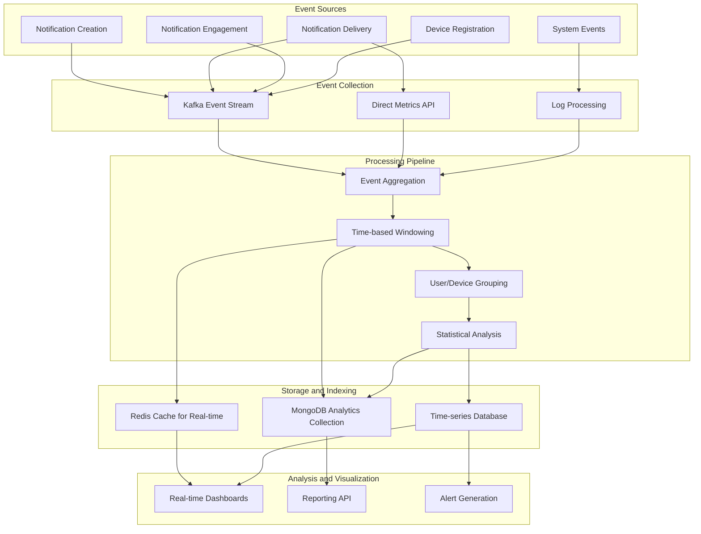
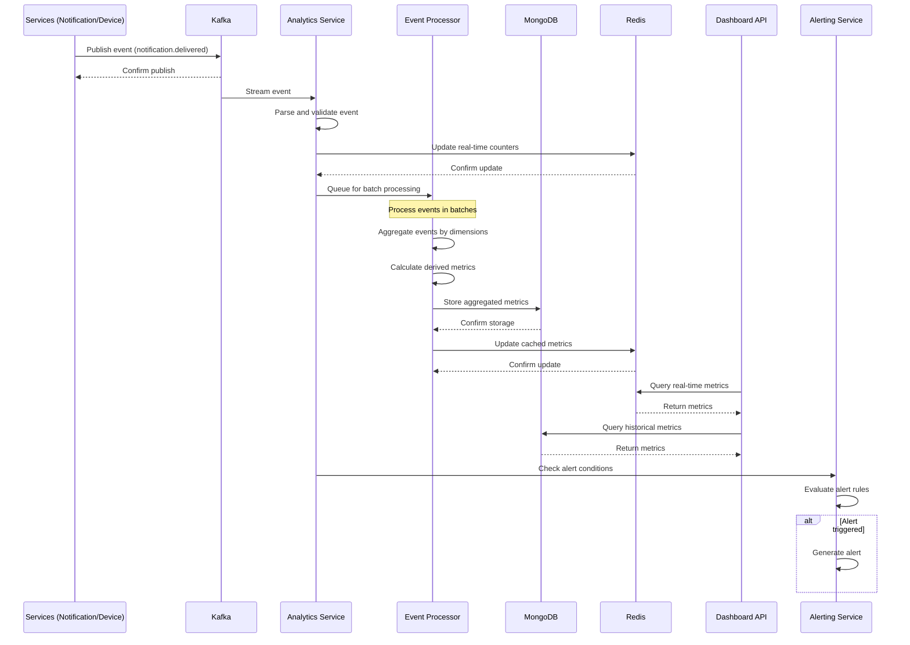
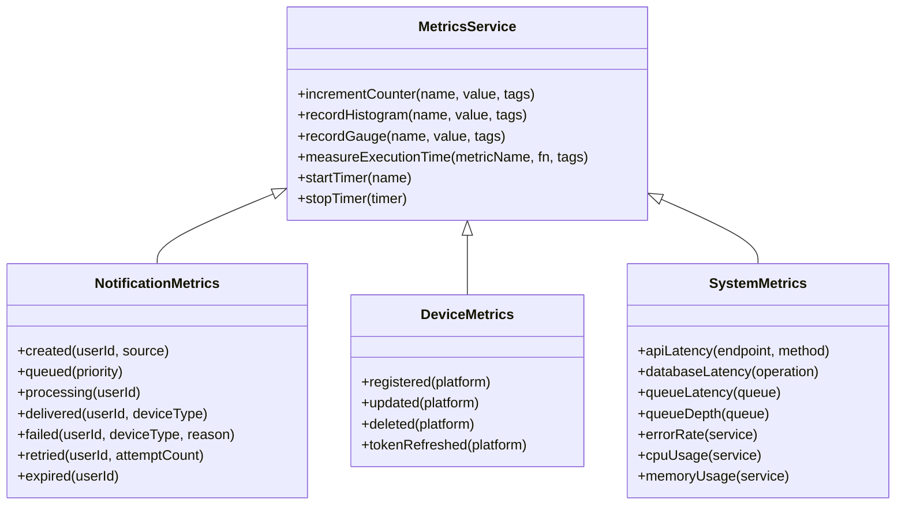
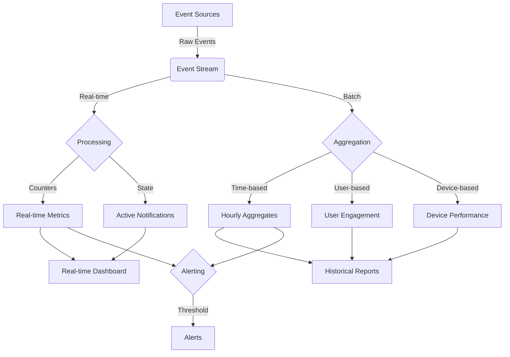
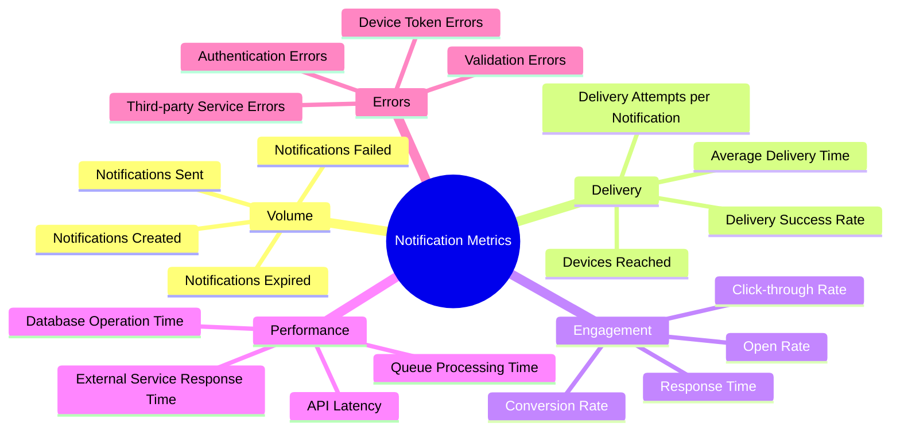
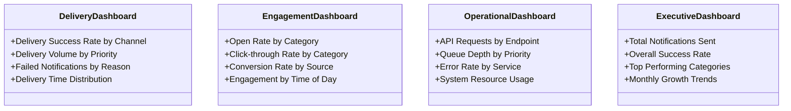

# Notification Analytics Flow

This document describes the analytics and metrics collection flow in the Notification Service.

## Flow Diagram



## Sequence Diagram



## Metrics Collection



## Analytics Data Flow



## Key Metrics



## Dashboard Layout



## Implementation Example (Metrics Service)

```typescript
/**
 * Example implementation of metrics collection in the Analytics Service
 */
class AnalyticsService {
  constructor(
    private readonly metricsService: MetricsService,
    private readonly repository: AnalyticsRepository,
    private readonly kafkaService: KafkaService,
  ) {
    this.initializeEventProcessing();
  }

  /**
   * Set up Kafka consumer for analytics events
   */
  private initializeEventProcessing(): void {
    this.kafkaService.subscribe(
      'notification-events',
      'analytics-service',
      async (message) => await this.processEvent(message)
    );
  }

  /**
   * Process an analytics event from Kafka
   */
  private async processEvent(event: any): Promise<void> {
    try {
      switch (event.event_type) {
        case 'notification.created':
          this.trackNotificationCreated(event);
          break;
        case 'notification.delivered':
          this.trackNotificationDelivered(event);
          break;
        case 'notification.failed':
          this.trackNotificationFailed(event);
          break;
        case 'notification.opened':
          this.trackNotificationOpened(event);
          break;
        // Additional event types
      }
      
      // Store event for batch processing
      await this.repository.storeEvent(event);
    } catch (error) {
      console.error(`Error processing analytics event: ${error.message}`);
    }
  }
  
  /**
   * Track notification created metrics
   */
  private trackNotificationCreated(event: any): void {
    const { user_id, source, priority } = event.data;
    
    // Increment counters
    this.metricsService.incrementCounter('notifications.created', 1, {
      user_id,
      source,
      priority,
    });
    
    // Additional metrics
  }
  
  /**
   * Track notification delivered metrics
   */
  private trackNotificationDelivered(event: any): void {
    const { user_id, device_id, platform, attempt_number } = event.data;
    
    // Increment counters
    this.metricsService.incrementCounter('notifications.delivered', 1, {
      user_id,
      platform,
    });
    
    // Record delivery time
    const deliveryTime = Date.now() - new Date(event.data.created_at).getTime();
    this.metricsService.recordHistogram('notification.delivery_time', deliveryTime, {
      platform,
      priority: event.data.priority,
    });
    
    // Additional metrics
  }

  /**
   * Generate aggregated metrics reports
   */
  async generateDailyMetricsReport(): Promise<any> {
    return await this.repository.getAggregatedMetrics({
      timeRange: {
        start: /* yesterday */,
        end: /* today */,
      },
      granularity: 'hourly',
    });
  }
}
``` 