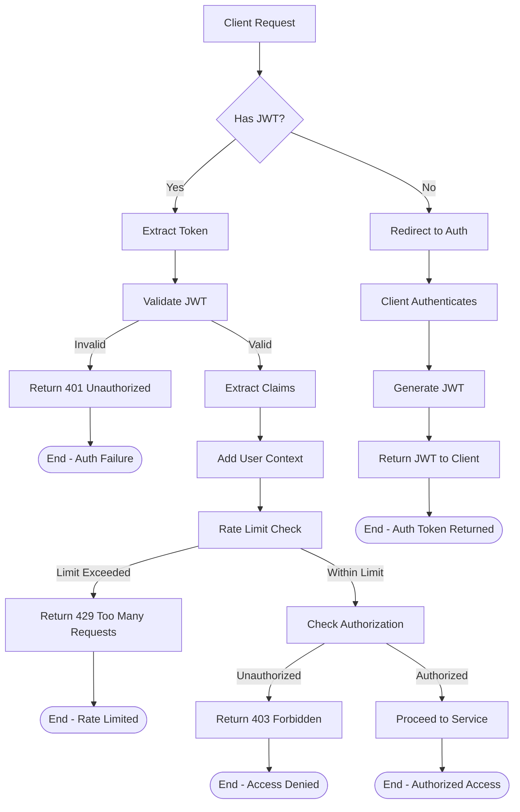
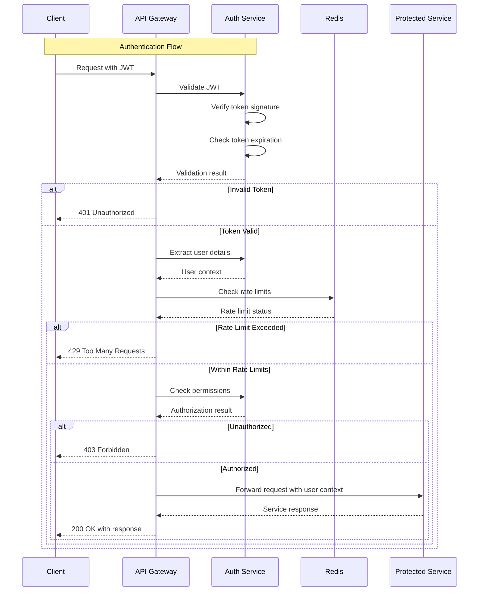
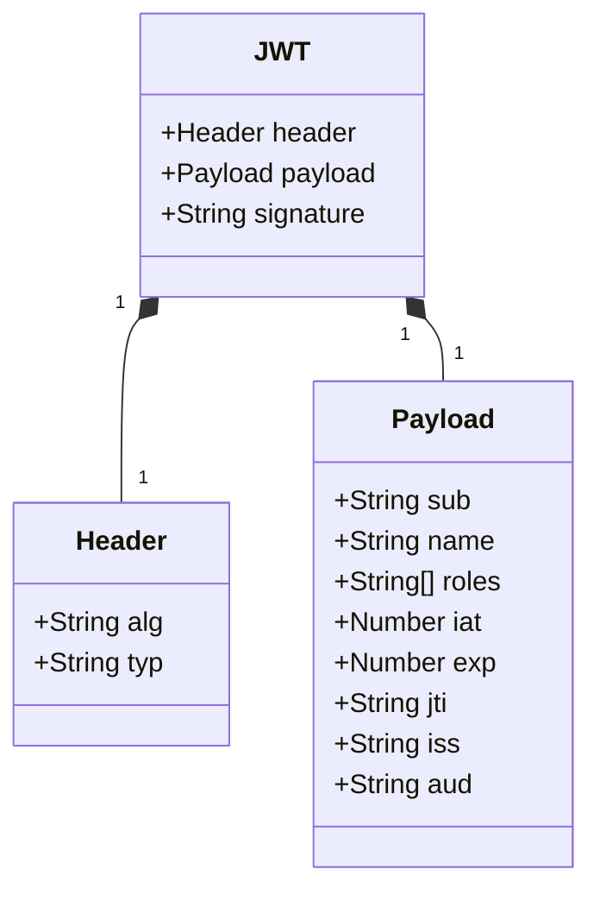
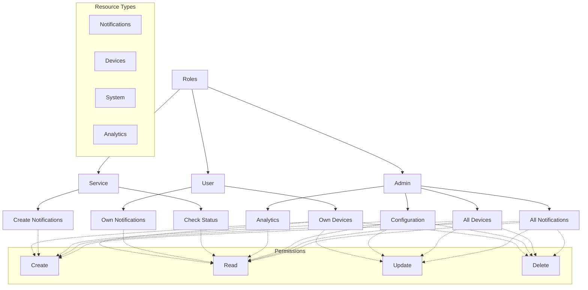
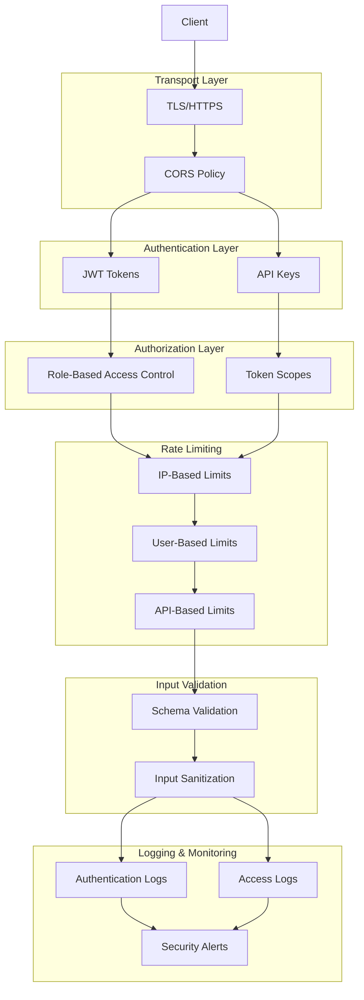
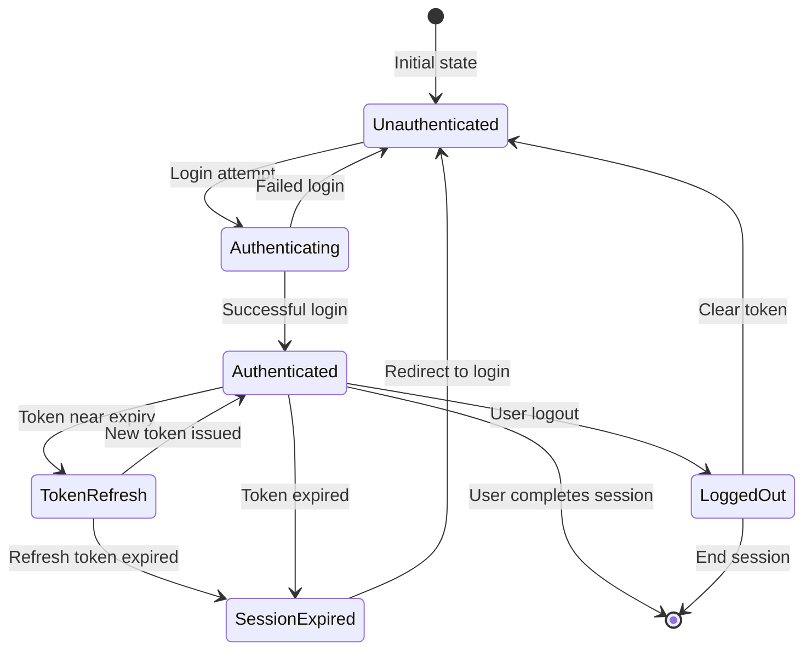
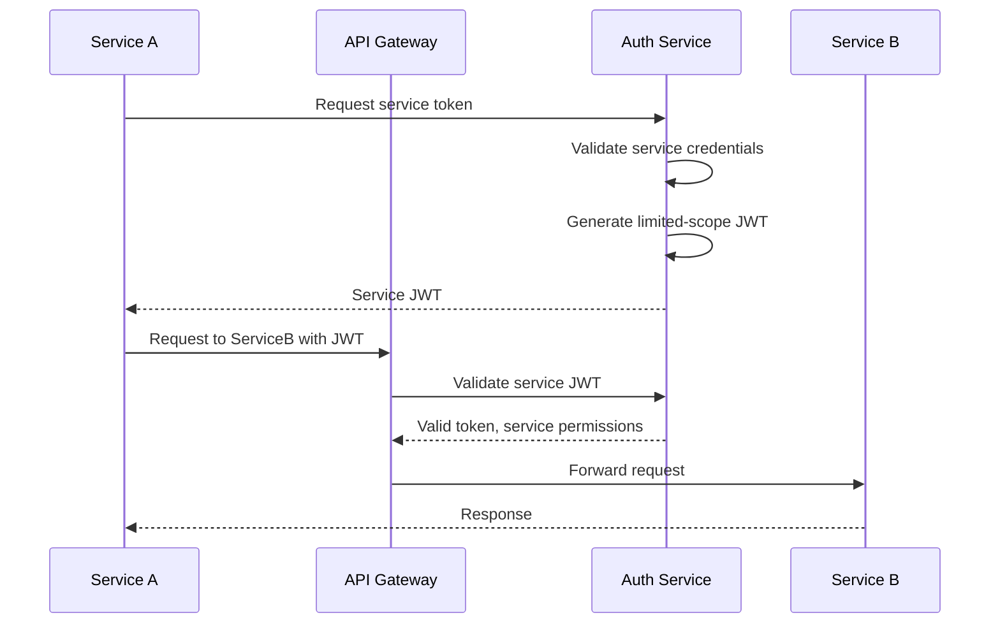

# Authentication and Security Flow

This document describes the authentication and security flow in the Notification Service.

## Authentication Flow Diagram



## Authentication Sequence Diagram



## JWT Structure



## Role-Based Access Control



## Security Implementations



## Authentication States



## Service-to-Service Authentication



## Rate Limiting Implementation

```mermaid
graph TD
    A[Request] --> B[Extract Identifier]
    B -->|API Key| C[Service Limiter]
    B -->|User ID| D[User Limiter]
    B -->|IP Address| E[IP Limiter]
    
    C --> F{Check Redis Counter}
    D --> F
    E --> F
    
    F -->|Limit Exceeded| G[Return 429]
    G --> H[Add Retry-After Header]
    
    F -->|Within Limit| I[Increment Counter]
    I --> J[Set TTL if New Key]
    J --> K[Process Request]
    
    subgraph "Redis Implementation"
        R1[key: "rate:ip:192.168.1.1:api/notifications"]
        R2[value: "5"]
        R3[ttl: "60 seconds"]
    end
```

## Auth Middleware Implementation

```typescript
/**
 * Example JWT authentication middleware implementation
 */
@Injectable()
export class AuthMiddleware implements NestMiddleware {
  constructor(
    private readonly authService: AuthService,
    private readonly rateLimit: RateLimitService,
  ) {}

  async use(req: Request, res: Response, next: NextFunction) {
    try {
      // Extract token from header
      const authHeader = req.headers.authorization;
      
      if (!authHeader) {
        throw new UnauthorizedException('Missing authorization header');
      }
      
      const token = authHeader.split(' ')[1];
      
      if (!token) {
        throw new UnauthorizedException('Invalid authorization format');
      }
      
      // Validate token
      const payload = await this.authService.validateToken(token);
      
      // Check if token is about to expire and add refresh header if needed
      const expiresIn = (payload.exp * 1000) - Date.now();
      if (expiresIn < 300000) { // Less than 5 minutes
        res.setHeader('X-Token-Refresh', 'true');
      }
      
      // Add user info to request
      req['user'] = payload;
      
      // Check rate limits
      const rateLimitResult = await this.rateLimit.checkLimit(
        payload.sub,
        req.path,
        req.method
      );
      
      if (!rateLimitResult.allowed) {
        res.setHeader('Retry-After', rateLimitResult.retryAfter.toString());
        throw new HttpException('Rate limit exceeded', 429);
      }
      
      // Proceed to next middleware/handler
      next();
    } catch (error) {
      // Handle different types of errors
      if (error instanceof UnauthorizedException) {
        throw error;
      } else if (error instanceof HttpException) {
        throw error;
      } else {
        throw new UnauthorizedException('Invalid token');
      }
    }
  }
}
``` 