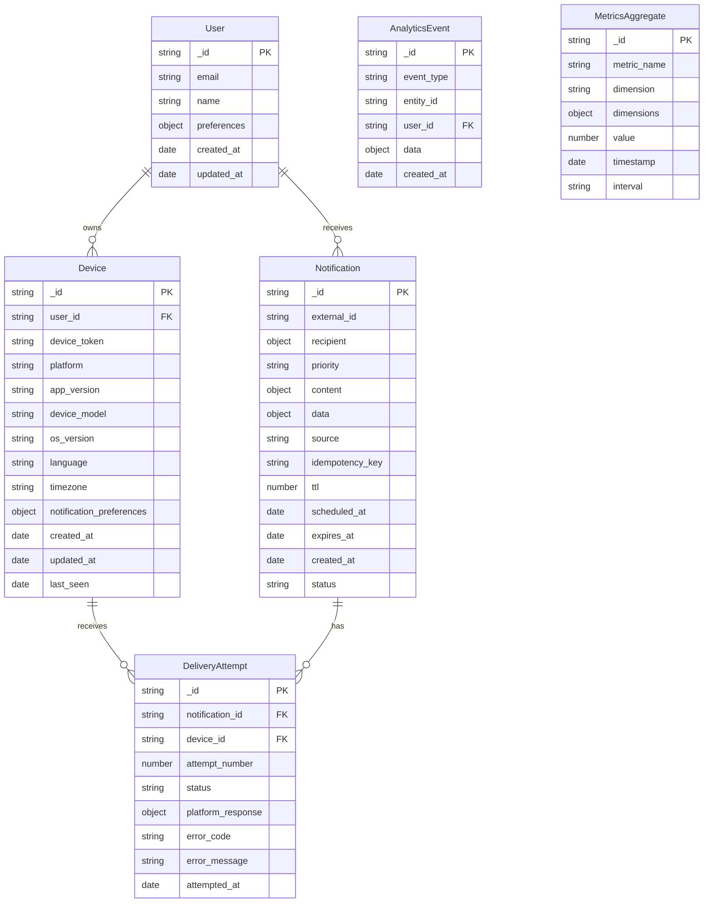
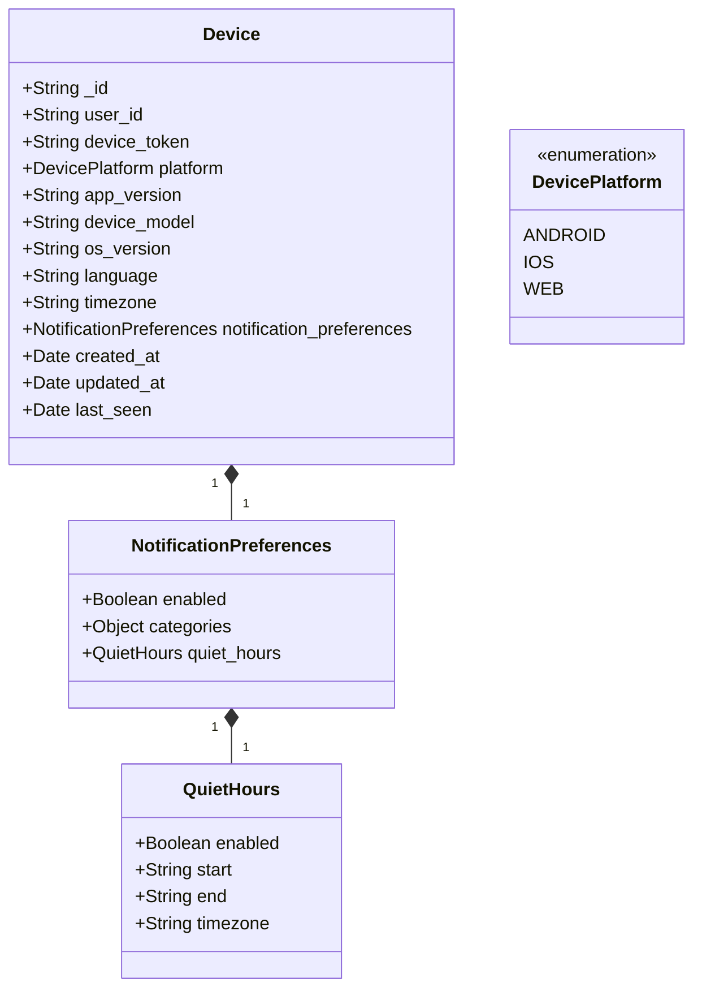
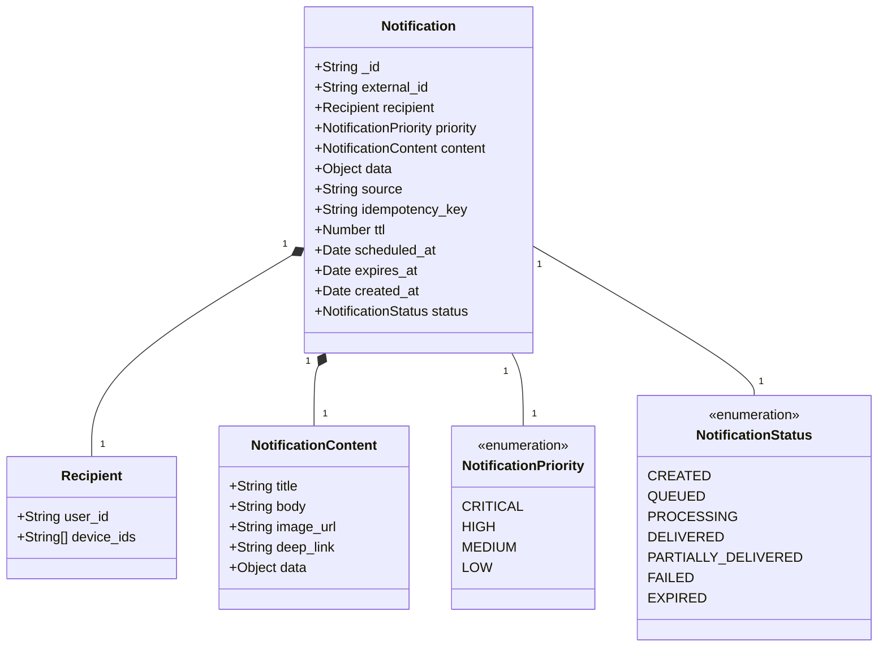
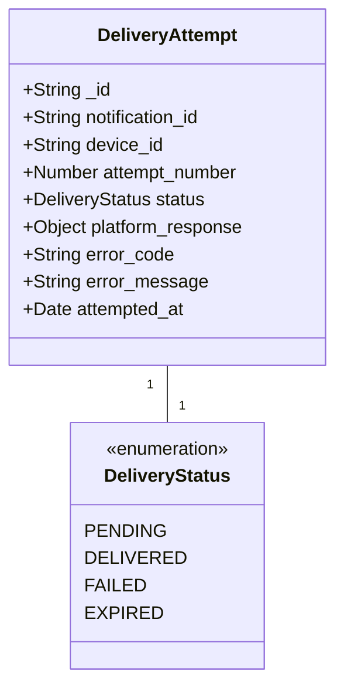

# Database Schema Design

This document describes the database schema design for the Notification Service.

## MongoDB Collections



## Device Collection Schema



## Notification Collection Schema



## Delivery Attempt Collection Schema



## Redis Data Structures

### Rate Limiting

```
Key pattern: rate_limit:{scope}:{identifier}:{endpoint}
Type: Counter with TTL
Example: rate_limit:user:123:notifications (value: 5, TTL: 60s)
```

### Device State Caching

```
Key pattern: device:{device_id}:state
Type: Hash
Fields:
  - online: Boolean
  - last_active: Timestamp
  - app_foreground: Boolean
  - notification_enabled: Boolean
TTL: 3600s (1 hour)
```

### Notification Queues

```
Key pattern: queue:{priority}
Type: Sorted Set
Members: notification_ids
Score: scheduled time (epoch milliseconds)
Example: queue:critical → ["notif123": 1623456789000, "notif124": 1623456790000]
```

### Temporary Token Storage

```
Key pattern: token:{token_id}
Type: String
Value: JWT token
TTL: Token expiration time
```

## MongoDB Indexing Strategy

### Device Collection Indexes

```
db.devices.createIndex({ "user_id": 1 })
db.devices.createIndex({ "device_token": 1 }, { unique: true })
db.devices.createIndex({ "platform": 1 })
db.devices.createIndex({ "last_seen": 1 })
```

### Notification Collection Indexes

```
db.notifications.createIndex({ "recipient.user_id": 1 })
db.notifications.createIndex({ "idempotency_key": 1 }, { unique: true })
db.notifications.createIndex({ "status": 1 })
db.notifications.createIndex({ "created_at": 1 })
db.notifications.createIndex({ "expires_at": 1 })
db.notifications.createIndex({ "scheduled_at": 1 })
```

### Delivery Attempt Collection Indexes

```
db.delivery_attempts.createIndex({ "notification_id": 1, "device_id": 1, "attempt_number": 1 })
db.delivery_attempts.createIndex({ "notification_id": 1, "status": 1 })
db.delivery_attempts.createIndex({ "device_id": 1 })
db.delivery_attempts.createIndex({ "attempted_at": 1 })
```

### Analytics Collection Indexes

```
db.analytics_events.createIndex({ "event_type": 1, "created_at": 1 })
db.analytics_events.createIndex({ "user_id": 1, "created_at": 1 })
db.analytics_events.createIndex({ "entity_id": 1, "event_type": 1 })

db.metrics_aggregates.createIndex({ "metric_name": 1, "timestamp": 1 })
db.metrics_aggregates.createIndex({ "metric_name": 1, "dimensions.user_id": 1, "timestamp": 1 })
db.metrics_aggregates.createIndex({ "metric_name": 1, "dimensions.platform": 1, "timestamp": 1 })
```

## Sharding Strategy

For large-scale deployments, the MongoDB collections can be sharded as follows:

### Device Collection

```
sh.shardCollection("notification_db.devices", { "user_id": "hashed" })
```

### Notification Collection

```
sh.shardCollection("notification_db.notifications", { "recipient.user_id": "hashed" })
```

### Delivery Attempt Collection

```
sh.shardCollection("notification_db.delivery_attempts", { "notification_id": "hashed" })
```

### Analytics Collections

```
sh.shardCollection("notification_db.analytics_events", { "created_at": 1, "_id": 1 })
sh.shardCollection("notification_db.metrics_aggregates", { "timestamp": 1, "metric_name": 1 })
``` 