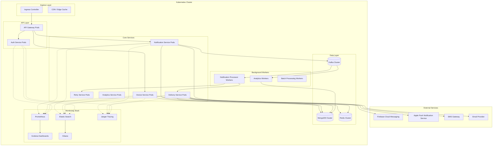
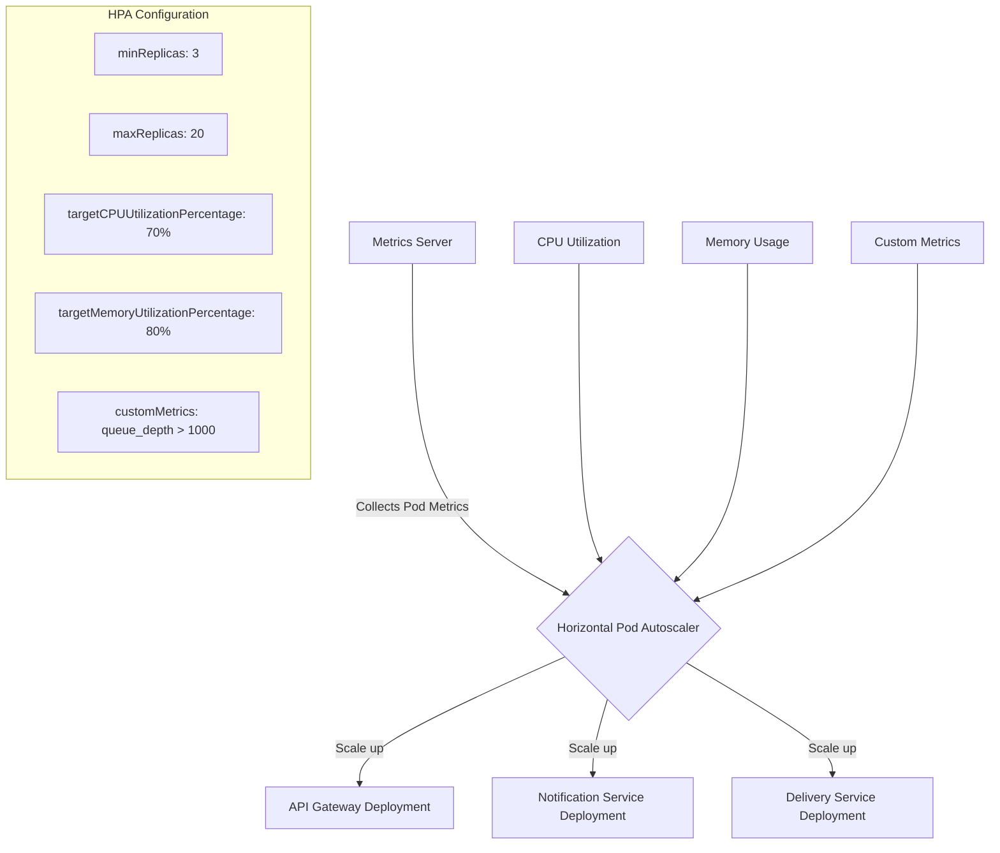
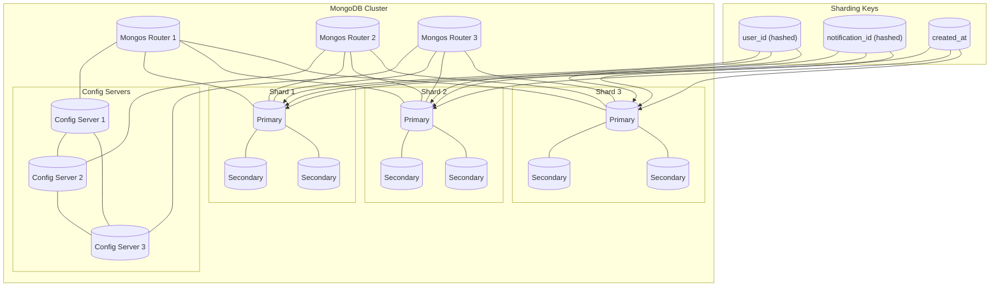
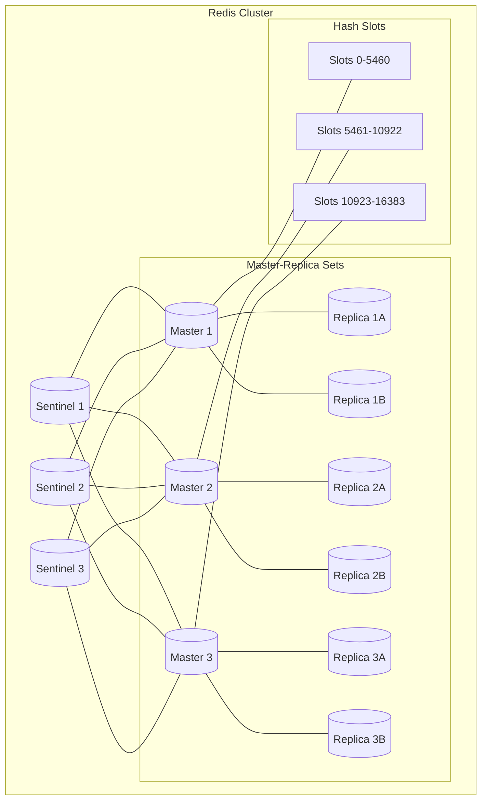
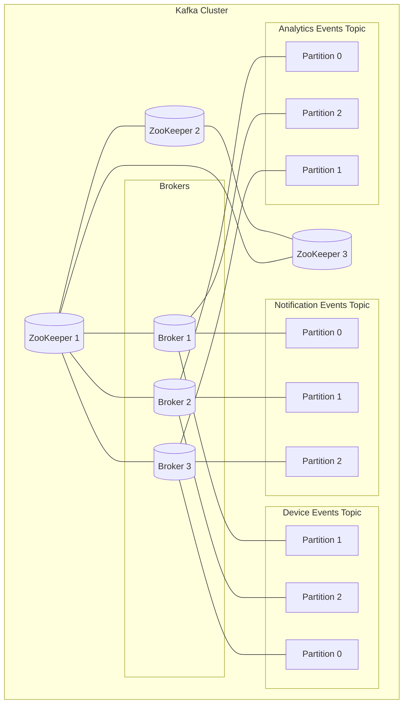
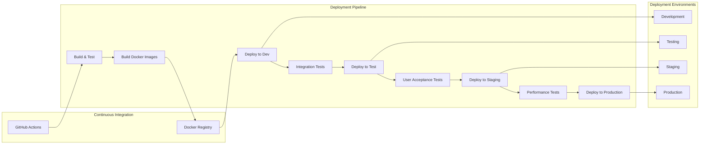
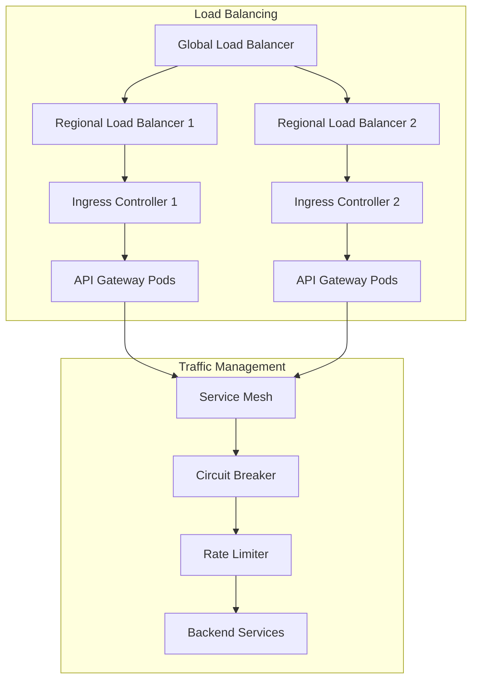
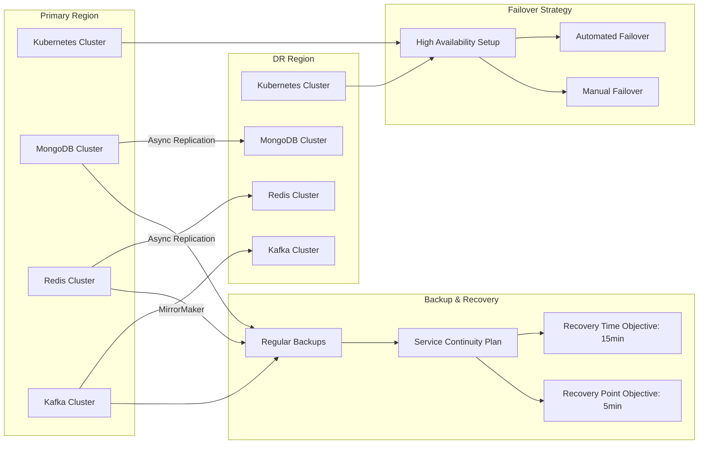

# Deployment and Scaling Architecture

This document describes the deployment architecture and scaling strategy for the Notification Service.

## Kubernetes Deployment Architecture

## Horizontal Pod Autoscaling

## Database Scaling Strategy

## Redis Scaling Architecture

## Kafka Scaling Architecture

## Production Deployment Environments

## Load Balancing Strategy

## Disaster Recovery Strategy

