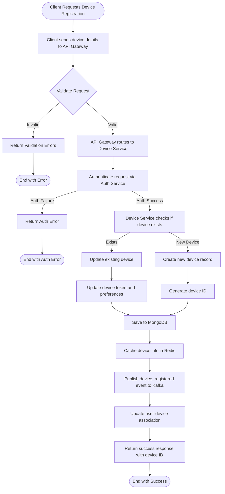
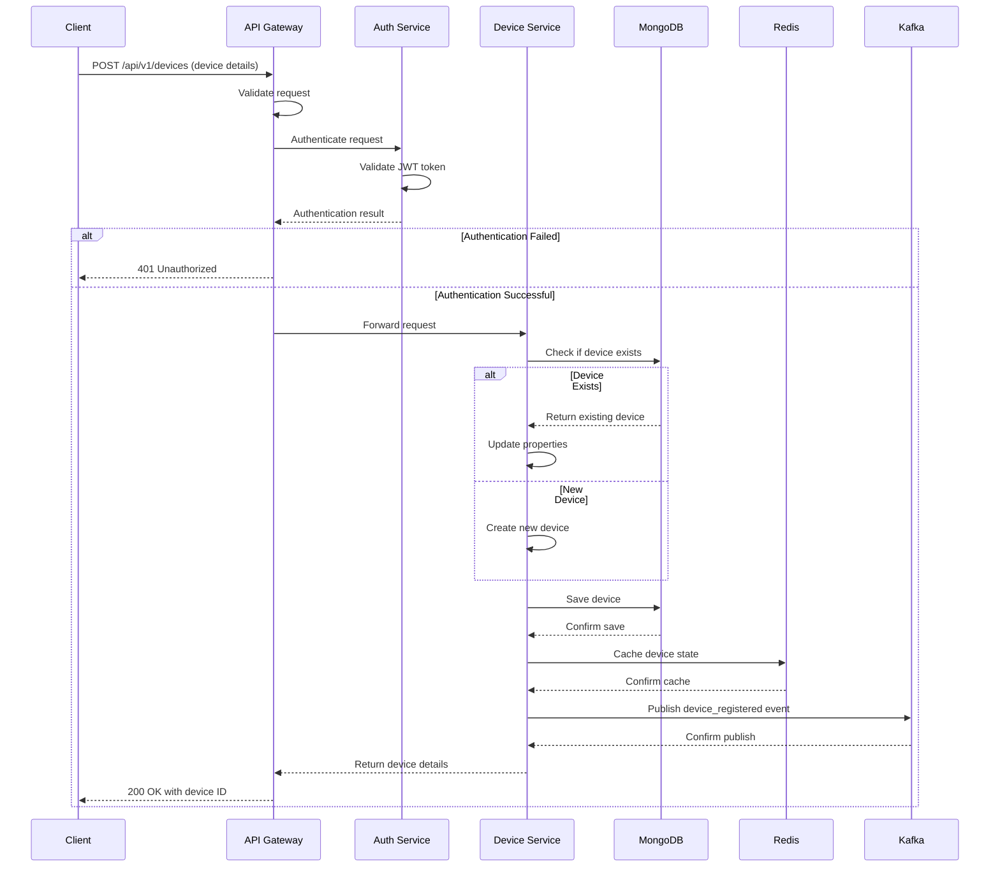
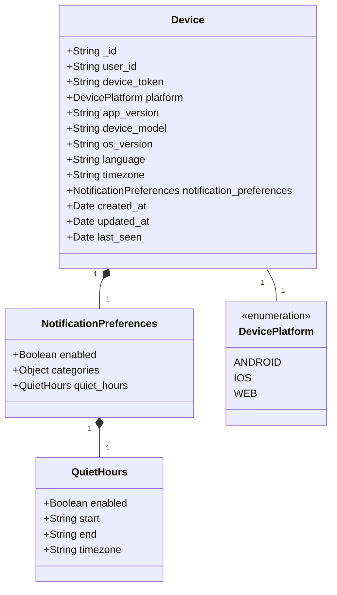

# Device Registration Flow

This document describes the flow for device registration in the Notification Service.

## Flow Diagram



## Sequence Diagram



## Data Model

The device registration process uses the following data model:



## API Contract

### Request

```
POST /api/v1/devices
Authorization: Bearer {jwt_token}
Content-Type: application/json

{
  "user_id": "user123",
  "device_token": "fcm-token-123",
  "platform": "android",
  "app_version": "1.0.0",
  "device_model": "Pixel 6",
  "os_version": "Android 13",
  "language": "en-US",
  "timezone": "America/New_York",
  "notification_preferences": {
    "enabled": true,
    "categories": {
      "marketing": true,
      "transactional": true
    },
    "quiet_hours": {
      "enabled": true,
      "start": "22:00",
      "end": "08:00",
      "timezone": "America/New_York"
    }
  }
}
```

### Response

```
HTTP/1.1 200 OK
Content-Type: application/json

{
  "device_id": "device-456",
  "status": "registered"
}
``` 