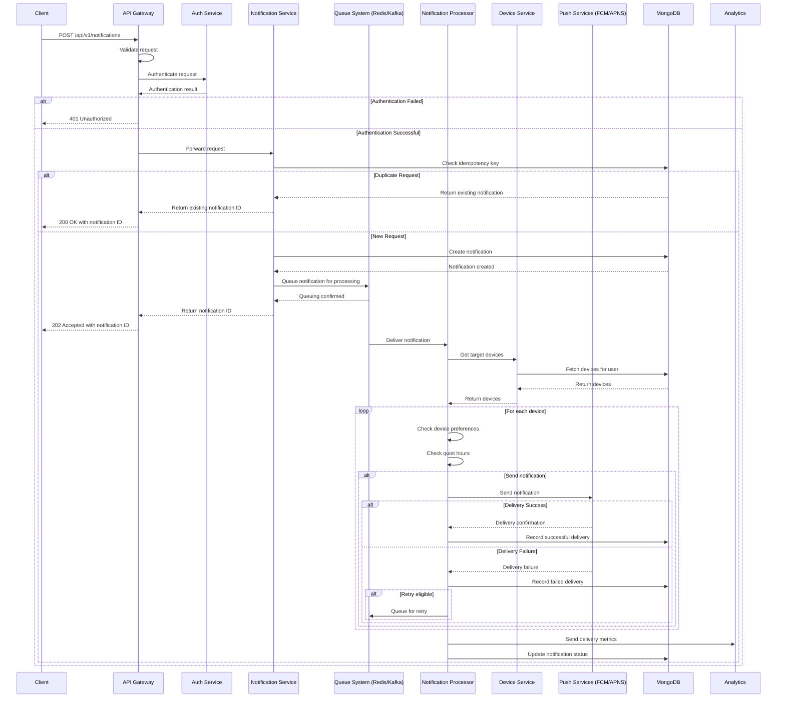
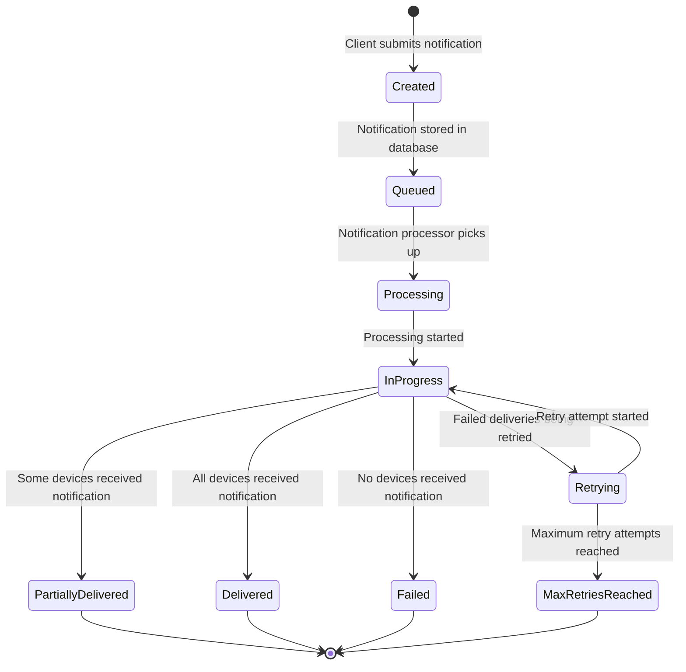
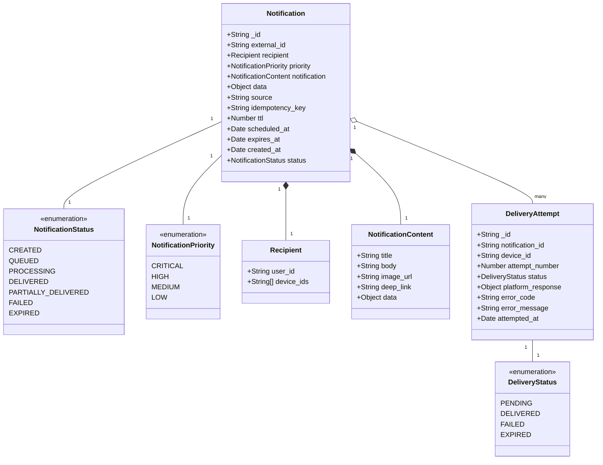

# Notification Creation and Delivery Flow

This document describes the flow for creating and delivering a notification in the Notification Service.

## Flow Diagram

```mermaid
flowchart TD
    Start([Client Creates Notification]) --> A[Client sends notification data to API Gateway]
    A --> B{Validate Request}
    B -->|Invalid| C[Return Validation Errors]
    C --> End1([End with Error])
    
    B -->|Valid| D[API Gateway routes to Notification Service]
    D --> E[Authenticate request via Auth Service]
    
    E -->|Auth Failure| F[Return Auth Error]
    F --> End2([End with Auth Error])
    
    E -->|Auth Success| G[Check idempotency key]
    G -->|Duplicate| H[Return existing notification ID]
    H --> End3([End with Success - Duplicate])
    
    G -->|New Notification| I[Create notification record]
    I --> J[Determine notification priority]
    
    J -->|Critical/High| K[Queue in Redis for immediate processing]
    J -->|Medium/Low| L[Queue in Kafka for batch processing]
    
    K --> M[Notification Processor picks up from queue]
    L --> M
    
    M --> N[Get target devices from Device Service]
    N -->|No devices| O[Log no devices found]
    O --> End4([End with No Devices])
    
    N -->|Devices found| P{For each device}
    P --> Q[Check notification preferences]
    Q -->|Notifications disabled| R[Skip device]
    R --> P
    
    Q -->|Notifications enabled| S[Check quiet hours]
    S -->|In quiet hours| T[Skip device or queue for later]
    T --> P
    
    S -->|Not in quiet hours| U[Format notification for device platform]
    U --> V[Send to appropriate service (FCM/APNS)]
    
    V -->|Success| W[Record successful delivery]
    V -->|Failure| X[Record failed delivery]
    X --> Y{Retry eligible?}
    Y -->|Yes| Z[Queue for retry with backoff]
    Z --> P
    Y -->|No| AA[Mark as permanently failed]
    AA --> P
    
    W --> P
    
    P -->|All devices processed| AB[Update notification status]
    AB --> AC[Send delivery metrics to Analytics]
    AC --> AD[Return notification status]
    AD --> End5([End with Success])
```

## Sequence Diagram



## State Diagram



## Data Model



## API Contract

### Request

```
POST /api/v1/notifications
Authorization: Bearer {jwt_token}
Content-Type: application/json

{
  "recipient": {
    "user_id": "user123",
    "device_ids": ["device-456"] // Optional
  },
  "priority": "high",
  "notification": {
    "title": "Your order has shipped",
    "body": "Your order #12345 has been shipped and will arrive tomorrow.",
    "image_url": "https://example.com/shipped.png",
    "deep_link": "app://orders/12345"
  },
  "data": {
    "order_id": "12345"
  },
  "source": "orders-service",
  "idempotency_key": "order-12345-shipped-20230615",
  "ttl": 3600, // Optional, time-to-live in seconds
  "scheduled_at": "2023-07-22T15:00:00Z" // Optional
}
```

### Response

```
HTTP/1.1 202 Accepted
Content-Type: application/json

{
  "notification_id": "notif-123",
  "status": "accepted"
}
```

### Check Status Request

```
GET /api/v1/notifications/notif-123/status
Authorization: Bearer {jwt_token}
```

### Check Status Response

```
HTTP/1.1 200 OK
Content-Type: application/json

{
  "notification_id": "notif-123",
  "status": "delivered",
  "created_at": "2023-07-21T12:34:56Z",
  "processed_at": "2023-07-21T12:35:01Z",
  "delivery_attempts": [
    {
      "device_id": "device-456",
      "attempt_number": 1,
      "status": "delivered",
      "attempted_at": "2023-07-21T12:35:01Z"
    }
  ]
}
``` 