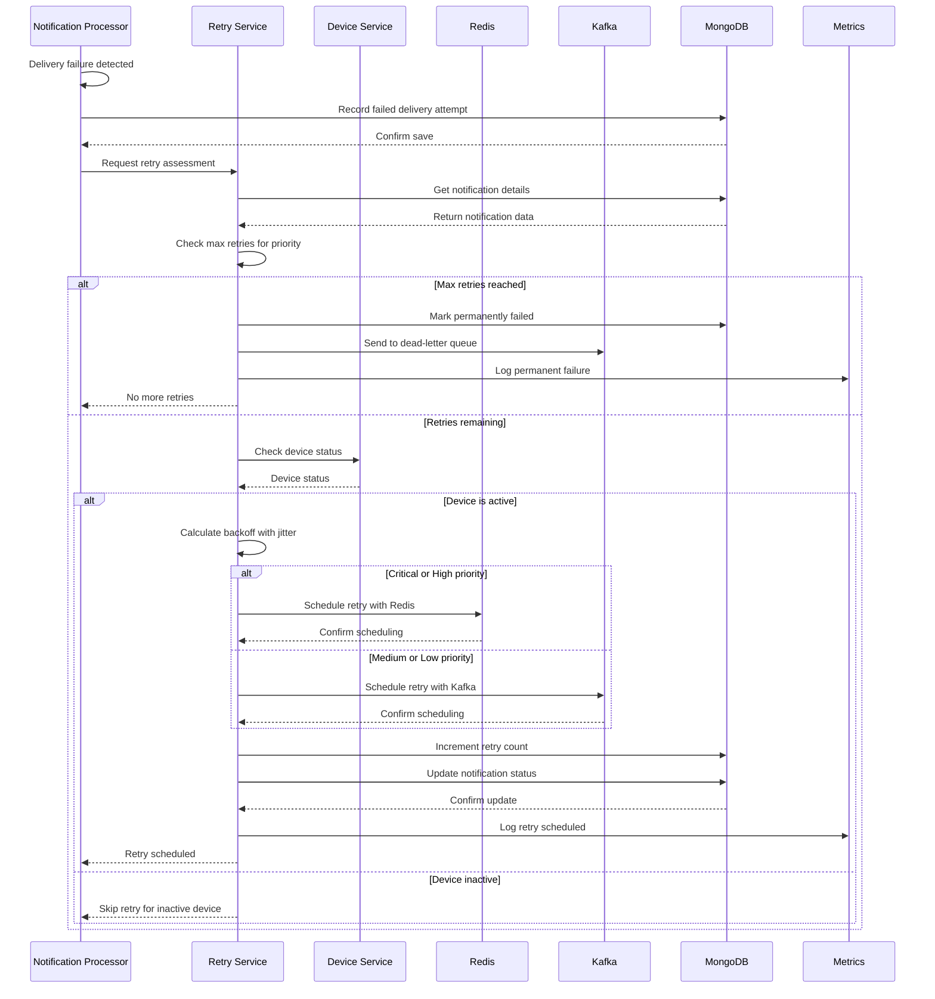
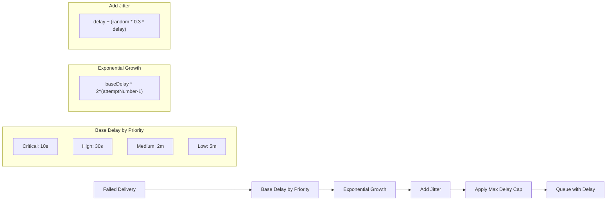
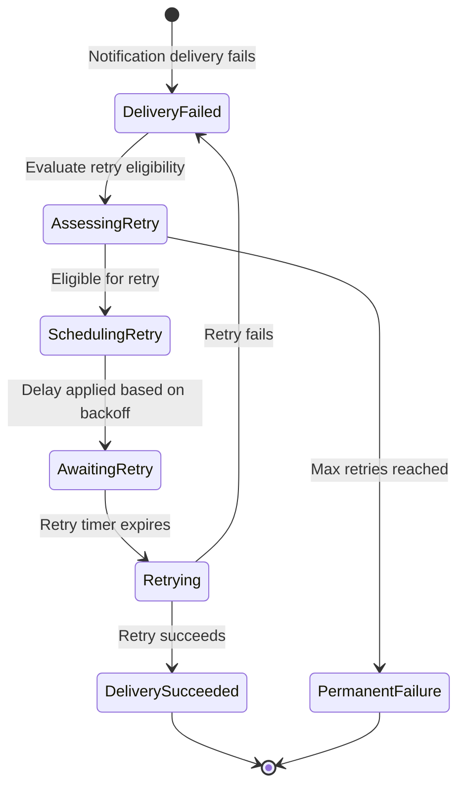

# Notification Retry Mechanism

This document describes the retry mechanism for failed notification deliveries in the Notification Service.

## Flow Diagram

```mermaid
flowchart TD
    Start([Notification Delivery Failed]) --> A[Record failed delivery attempt]
    A --> B{Check max retries}
    B -->|Max retries reached| C[Mark as permanently failed]
    C --> D[Send to dead-letter queue]
    D --> E[Update notification status]
    E --> F[Log failure to metrics]
    F --> End1([End - No more retries])
    
    B -->|Retries remaining| G[Calculate backoff delay]
    G --> H[Get device information]
    H --> I[Check device active status]
    
    I -->|Device inactive| J[Skip retry for device]
    J --> End2([End - Device inactive])
    
    I -->|Device active| K[Apply exponential backoff]
    K --> L[Apply jitter to prevent thundering herd]
    
    L --> M{Notification priority}
    M -->|Critical| N[Short backoff: 10s base]
    M -->|High| O[Medium backoff: 30s base]
    M -->|Medium| P[Long backoff: 2m base]
    M -->|Low| Q[Extended backoff: 5m base]
    
    N --> R[Schedule retry with Redis]
    O --> R
    P --> S[Schedule retry with Kafka]
    Q --> S
    
    R --> T[Increment retry count]
    S --> T
    
    T --> U[Update notification status to "retrying"]
    U --> End3([End - Scheduled for retry])
```

## Sequence Diagram



## Backoff Strategy Implementation



## State Diagram



## Implementation Details

### Retry Configuration by Priority

```mermaid
classDiagram
    class RetryConfig {
        +getPriorityBackoff(priority, attemptNumber)
        +shouldRetry(priority, attemptNumber)
        +calculateBackoffDelay(priority, attemptNumber)
        +addJitter(delay)
    }
    
    class PriorityConfig {
        +NotificationPriority priority
        +Number maxRetries
        +Number baseDelayMs
        +Number maxDelayMs
    }
    
    RetryConfig "1" -- "4" PriorityConfig
    
    class PriorityConfigs {
        CRITICAL: {maxRetries: 10, baseDelayMs: 10000, maxDelayMs: 300000}
        HIGH: {maxRetries: 8, baseDelayMs: 30000, maxDelayMs: 900000}
        MEDIUM: {maxRetries: 5, baseDelayMs: 120000, maxDelayMs: 3600000}
        LOW: {maxRetries: 3, baseDelayMs: 300000, maxDelayMs: 7200000}
    }
```

### Retry Backoff Formula

The exponential backoff delay is calculated using the following formula:

```
delay = baseDelay * (2 ^ (attemptNumber - 1))
```

To prevent the "thundering herd" problem, a jitter is applied:

```
jitter = random(0, 0.3) * delay
finalDelay = delay + jitter
```

### Code Example (TypeScript)

```typescript
/**
 * Calculate backoff delay with jitter based on priority and attempt number
 */
calculateBackoffDelay(priority: NotificationPriority, attemptNumber: number): number {
  const config = this.getPriorityConfig(priority);
  
  // Exponential backoff: baseDelay * 2^(attemptNumber-1)
  const delay = config.baseDelayMs * Math.pow(2, attemptNumber - 1);
  
  // Cap at maximum delay
  const cappedDelay = Math.min(delay, config.maxDelayMs);
  
  // Add jitter to prevent thundering herd
  return this.addJitter(cappedDelay);
}

/**
 * Add random jitter to delay to prevent thundering herd
 */
private addJitter(delay: number): number {
  // Add up to 30% random jitter
  const jitter = Math.random() * 0.3 * delay;
  return Math.floor(delay + jitter);
}
``` 